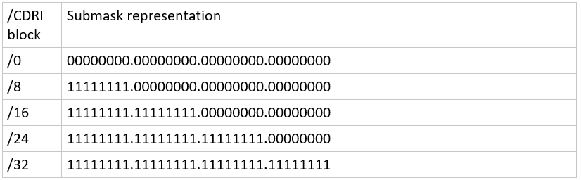

# Networking and Configuration Management
# N-tier Architecture vs Monolith
 
## __What is a network?__
A network consists of two or more computers that are linked in order to share resources (such as printers and CDs), 
exchange files, or allow electronic communications. The computers on a network may be linked through cables, telephone 
lines, radio waves, satellites, or infrared light beams.

The common types of network includes:
- Local Area Network (LAN)
- Wide Area Network (WAN)

## What is an IP?

Stands for internet protocol, is the internet's principal set of rules for communications.
IP is part of an internet protocol suite, which also includes Transmission Control Protocol (TCP)
The IP governs rules for packetising, addressing, transmitting, routing and receiving data over networks

## Maximum IP in IPV4?

There is a finite amount of ip addresses, and ipv4 uses 32 bit IP addresses, and with 32 bits the maximum number of IP 
addresses is 2^32. Or **4,294,967,266**. This may run out in our lifetime with more and more machines needing IP addresses therefore 

To deal with the long-anticipated problem of IPv4 address exhaustion they invented IPV6. Now IPV6 has a 128 bit 
architecture and can have a possible 2^128 ip addresses.

## IPV4 VS IPV6 
There are two types of IPs:

     IPV4
        * 4 bytes each (4 * 8 = 2^32)
        * total range = 4.3 billion possible addresses
        * 123.45.67.89
    
     IPV6
        * 128 bits each (2^128)
        * total range = 340 undecillion possible addresses
        * **2001:db8::ff00:42:8329**

# Subnet mask/Cidr block
Submask works at the end of the IP address:    
	- Represents the submask as a block at the end of the an IP    
	- It represents by the submask by adding the bits     
IPV4 you can have a maximum of 32 bit, when adding the 8 bits inside the 4 octets




__Class A__   
- Uses 8 bit   
- Most widespread 
- First Octet between 0-127
- Uses a default subnet mask of 255.0.0.0
```
2.134.213.2
```

Network use 24 bit 

__Class B__  
- Uses 16 Bit
- Network uses 16 Bit
- 128-191 as first octet
- Uses a default subnet mask of 255.255.0.0
```
135.58.24.17
```  

__Class C__   
- Most expensive - 24 bit address
- IP and Network 
- 192-223 as first octet 
- Uses a default subnet mask of 255.255.255.0
```
192.168.178.1
```  


# N-Tier Architecture
	- Monliths

## Monoliths
	- Big, solid single point of failure because it is one big block
	- Monolith architecture - describes an application that has everything working on the same server.
	- Everything running on machine/server:
		○ DB/Logic/Presentation

### Example
	- Database on top
	- NodeJS running on server


# Networking


The configuration of this scenario includes a virtual private cloud (VPC) with a public subnet and a private subnet.

• A VPC with a size /16 IPv4 CIDR block (example: 10.0.0.0/16). This provides 65,536 private IPv4 addresses.   
• A public subnet with a size /24 IPv4 CIDR block (example: 10.0.0.0/24). This provides 256 private IPv4 addresses. 
A public subnet is a subnet that's associated with a route table that has a route to an Internet gateway.    
• A private subnet with a size /24 IPv4 CIDR block (example: 10.0.1.0/24). This provides 256 private IPv4 addresses.


##  2-Tier Infrastructure
A two-tier architecture is a software architecture in which a presentation layer or interface runs on a client, and a data layer or data structure gets stored on a server. Separating these two components into different locations represents a two-tier architecture, as opposed to a single-tier architecture. Other kinds of multi-tier architectures add additional layers in distributed software design

### 3-Tier Infrastructure
	1. Public Layer
	2. Application Layer
    3. Database Layer

Cloud service (AWS) there is Virtual Private Cloud (database servers and web servers)
 DB:
-  2 tier architecture

 Within VPC we can allow for multiple IP addresses to connect, multiple users have 16IPv4 cidr block

## Terminology to master:
- ```VPC``` - Virtual Private Cloud in AWS to launch computing resources
- ```IGW``` - internet gateway - attached to the VPC, allows internet into VPC via route table
- ```Subnet``` - Internal networking
- ```NACLs``` - Network Access Control list, this is an optional layer of security for your machine. (A firewall at the level of a subnet)
- ```Route Tables``` - Contains a set of rules, called routes that determine where network traffic from a subnet or gateway is directed.
- ```SG``` - Security Group / Firewall
- ```EC2``` - Amazon Elastic Compute Cloud


### Interview*
AWS hosts a vpc where it creates two subnets (public and private)
	- Public subnet connects to IGW and VPC via route table
	- Private subnet connects to VPC via route table (private route)

## Ingress - inbound traffic 
SSH for us and automation servers 
Dev ports for us
Internet ports for the world  

## Egress - outbound traffic 
Default 0.0.0.0/0

NACLs for the public 
	- By default outbound traffic is denied
	- Rules number matter 
	- You can deny an IP as well as allow 

# Public 
## Ingress 
Allow port 80 
Allow port 443
Allow 22 on range of Ips
Allow ephemeral port on 0.0.0.0/0

## Egress 
All ports 0.0.0.0/0 

# Private

## Ingress
27017 from 123.10.1.0/24

## Egress
Allow all to 123.10.1.0/24
Only allows inbound traffic 