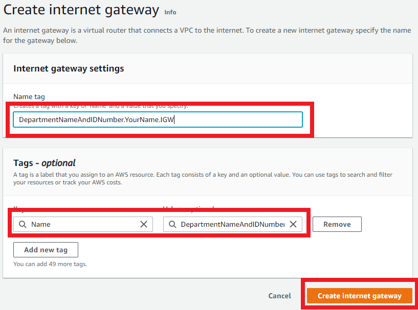
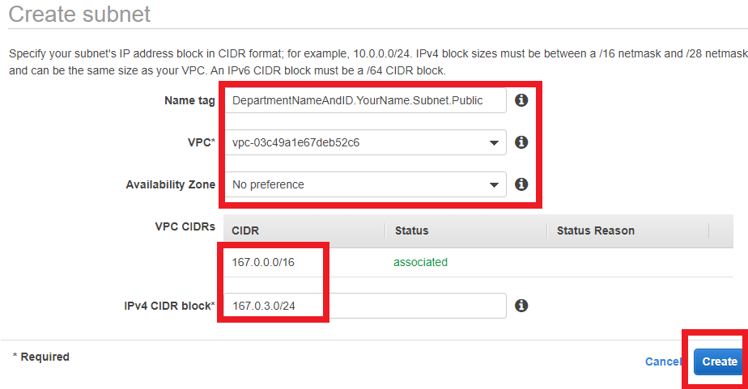

Resolution
### Create a customer gateway
1. Create VPC
    1. Configuration 
1. Open the Amazon VPC console.
2. In the navigation pane, under VPN Connections, choose Customer Gateways.
3. Choose Create Customer Gateway.
4. Enter a meaningful name for the customer gateway.
5. Choose an option for Static or Dynamic routing.
6.Enter the public IP address of your customer gateway device.
(Optional) Enter your BGP ASN if you selected the option for dynamic routing.  
8.Choose Yes, Create.


### Create VPC
1. Ensure region is ``Ireland ``
2. Click on ```Your VPC```
3. Create VPc ```NOT``` from ```Launch Wizard``` . To ```create VPC``` click button. 

    #### Configuration 
    1. Configure the settings as seen below:
    
    #### ```NOTE: The IP address can anything, 255 or below in first two numbers ``` 

### Create a Internet  gateway
1. In the Amazon VPC console, under VPN Connections, choose Virtual Private Gateways.
2. Choose Create Virtual Private Gateway.
3. Enter a meaningful name for the virtual private gateway.
4. Click Create Internet gateway

5. Select the new virtual private gateway and open the context (right-click) menu, and then choose Attach to VPC.

### Creating Public and Private Subnet
1. Click on subnets - create subnets
2. Give appropriate tag name
3. Select the VPC that was made earlier
4. Create ```IPv4 CIDR block*``` that slightly differs from the ```VPC CIDR``` as shown below:

5. ```REDO``` steps 1-4 but change public to private
#### ```NOTE: it is suggested to add just one more to the IPv4 CIDR block```

### Create a route table

1. check route table not assoicated with VPC already - keep for now - rename

2. Select route tables, create route table

3. Add tag =YourDepartmentNameAndID.YourName.Route.Public

4. Select your VPC

5. Create vpc

6. Edit Route - add 0.0.0.0/0 - target = internet gateway, choose your internet gateway

7. Subnet associations - edit subnet associations - add public subnet

### Security Group Rules - NACLs
#### Egress rules

- Defualt 0.0.0.0/0 auto set
- Allows everything to exit
- Ingress rules (rules for entry)
- NACLs for public
- By default outbound traffic is denied
- Rule numbers matter
- can deny IP as well as allow

    #### Ingress rules
    - port 22 from our IP
    - 80 for inter
    - 443
    - ephemeral on 0.0.0.0/0
    - 27017 to allow connection to private (db) subnet
    #### Egress rules
    
    - Allow all for now
    - Rules for public server

allow all outbound traffic to public server (245.20.1.0/24)xc
ingress 27017 from public server (245.20.1.0/24)
### Create NACL


### Create Instance
1. Follow the gif to create the instance


## Testing - Inside GitBash
1. create an ec2 instance with VPC of the one just created

2. ssh into the instance

3. run sudo apt-get install nginx

4. go onto your browser and insert the IP of the instance created

5. if VPC has been created effectively then you will Nginx install successful